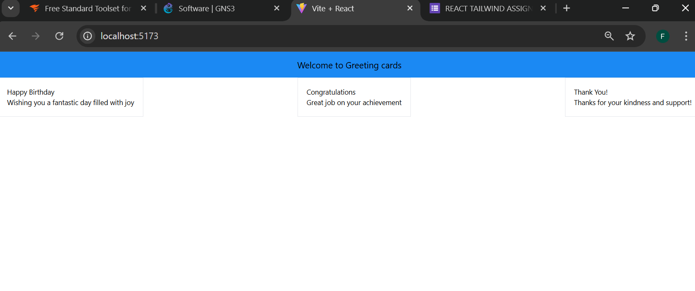

# React + Vite

This template provides a minimal setup to get React working in Vite with HMR and some ESLint rules.

Currently, two official plugins are available:

- [@vitejs/plugin-react](https://github.com/vitejs/vite-plugin-react/blob/main/packages/plugin-react/README.md) uses [Babel](https://babeljs.io/) for Fast Refresh
- [@vitejs/plugin-react-swc](https://github.com/vitejs/vite-plugin-react-swc) uses [SWC](https://swc.rs/) for Fast Refresh

EXPERIENCE
 Doing the project i learnt how to use tailwind to edit the styles, it was a liltle bit challenging but with careful inspection i was able to rectify the issue.
 OBJECTIVE
 In summary, using React and Vite together, it provides an agile and efficient development environment, allowing you to build modern web applications with better performance and user experience.
 OVERVIEW
This project is a React application built with Vite and styled using Tailwind CSS. It allows users to:
-Display a welcoming header.
-Create and view multiple greeting cards with unique titles and messages.
KEY LEARNING
-Setting up a React project with Vite.
-Styling with Tailwind CSS.
-Creating reusable functional components.
-Passing props to display dynamic content.
SCREENSHOT
The screenshot below shows the output of the project:

- *Header*: Displays "Welcome to Greeting Cards."  
  

